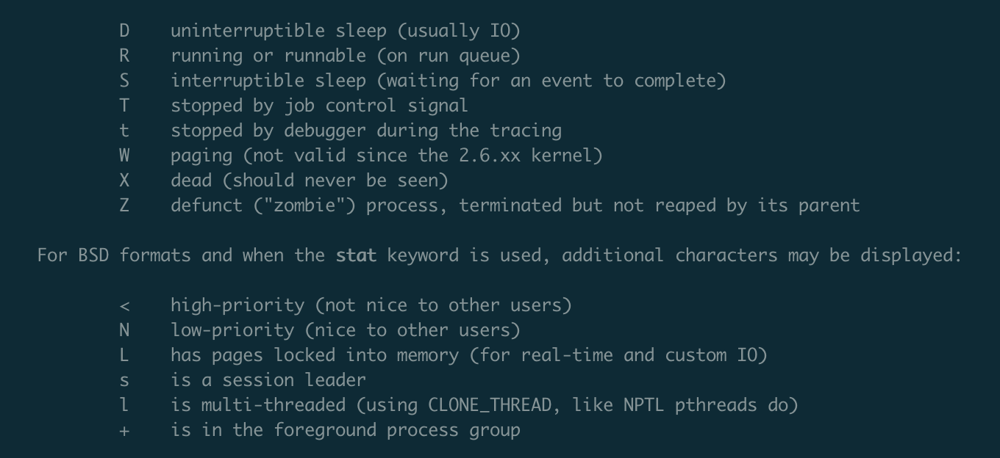

# 第一期 | Linux 性能优化实战 by 倪朋飞

>  第 1 阶段(CPU 性能篇)


## 02 | 基础篇：到底应该怎么理解“平均负载”？

文章中涉及到的命令：
	- uptime、w、top、htop：负载相关命令
	- grep 'model name' /proc/cpuinfo | wc -l ：查看逻辑 cpu 数量
	- lscpu：查看 cpu 信息
	- stress/stress-ng： Linux 系统压力测试工具
	- mpstat：是一个常用的多核 CPU 性能分析工具
	- pidstat：是一个常用的进程性能分析工具，用来实时查看进程的 CPU、内存、I/O 以及上下文切换等性能指标
	- lsof


### 什么是平均负载？

> 平均负载是指**单位时间内，系统处于可运行状态和不可中断状态的平均进程数，也就是平均活跃进程数。**

可运行状态的进程，是指正在使用 CPU 或者等待 CPU 的进程，使用 ps 命令看到的处于 R 状态的进程。

不可中断状态的进程，是正处于内核态关键流程中的进程，并且这些流程是不可打断的，比如最常见的是等待硬件设备的 I/O 响应。ps 命令中看到的 D 状态的进程。


#### 查看平均负载

可以使用 uptime、w、top 命令

```sh
$ uptime
 13:42:55 up  8:50,  0 users,  load average: 0.00, 0.00, 0.00
```

uptime 命令各字段的含义：
	- 当前时间
	- 系统运行时间
	- 登录的用户数
	- **1 分钟的平均负载**
	- **5 分钟的平均负载**
	- **15 分钟的平均负载**

` uptime 中平均负载有三个数值，这三个不同时间内的平均负载值可以反映系统平均负载的一个趋势，依据这个趋势做相应的操作。`


ps 命令中进程的状态：
	- D，不可中断的睡眠状态（通常是 IO）
	- R，运行中或者可运行状态
	- S，可中断的睡眠状态（等待事件去完成）
	- T，被任务控制信号挂起的的状态
	- t，追踪过程中被调试器挂起的状态
	- W，已废弃
	- X，退出状态（永远不会被看到）
	- Z，停止了但是没有被父进程回收的僵尸进程




### 平均负载为多少合适？

`平均负载最理想的情况是等于 CPU 个数。`

逻辑 CPU 核心数 = 物理 CPU 数 *  每颗 CPU 核心数 * 每个核心的超线程数

1. 查看逻辑 CPU 核心数

```sh
$ grep 'model name' /proc/cpuinfo | wc -l
4

## 或者
$ lscpu
...
```

#### 对于实际生产环境中，当平均负载高于 CPU 数量 70% 的时候，应该分析排查负载高的问题了。
>  （比如，机器的逻辑 CPU 数量为 4，当平均负载大于 2.8 的时候，就应该着手开始排查了。）

不过，更应该做的是，监控平均负载，根据历史数据，判断负载的变化趋势，当负载有明显的升高时，再去做分析和调查。


### 平均负载和 CPU 使用率的关系

CPU 使用率：单位时间内 CPU 繁忙情况的统计。与平均负载不一定完全对应。

- CPU 密集型进程，使用大量 CPU 会导致平均负载升高，此时这两者是一致的；
- I/O 密集型进程，等待 I/O 也会导致平均负载升高，但 CPU 使用率不一定很高；
- 大量等待 CPU 的进程调度也会导致平均负载升高，此时的 CPU 使用率也会比较高。


### 平均负载案例分析

前期准备：

``` sh
$ apt install stress stree-ng sysstat
```

#### 场景一：CPU 密集型

``` sh
# 在三个窗口中执行以下命令

$ uptime
# 模拟一个 CPU 使用率 100% 的场景
$ stress --cpu 1 --timeout 600
# 监控 uptime
$ watch -d uptime
# 监控所有的 CPU 的使用率情况
$ mpstat -P ALL 5
# 查询进程 CPU、wait 占用情况
$ pidstat -u 5 1
```


#### 场景二：I/O 密集型进程

``` sh
# 在三个窗口中执行以下命令

$ uptime
# 模拟 I/O 压力
$ stress -i 1 --timeout 600   # 此命令可能模拟不出来
$ stress-ng -i 1 --hdd 1 --timeout 600
# 监控 uptime
$ watch -d uptime
# 监控所有 CPU 的使用率情况
$ mpstat -P ALL 5
# 查询进程 CPU、wait 占用情况
$ pidstat -u 5 1
```

#### 场景三：大量进程的场景

``` sh
# 在三个窗口中执行以下命令

$ uptime
# 当系统中运行进程超出 CPU 运行能力时，就会出现等待 CPU 的进程。
# 模拟 8 个进程
$ stress -c 8 --timeout 600
# 监控 uptime
$ watch -d uptime
# 监控所有 CPU 的使用率情况
$ mpstat -P ALL 5
# 查询进程 CPU、wait 占用情况
$ pidstat -u 5 1
```


### 发现专栏精选留言

> @shellmode: 
>
> 在 sched/loadavg.c 中计算平均值的算法为EMA，这种算法的目的主要是“距离目标预测窗口越近，则数据的价值越高，对未来影响越大”
>
> 如果说“更快的计算”应该只有里面的 fixed_power_int 函数用 O(log n) 的时间来算 x^n
>
> 所以内核中用 EMA 来算 loadavg 本质上并不是增加计算性能，而是让 loadavg 的趋势化更明显


### 补充


解决 docker 中 ubuntu 系统 man 命令 "No manual entry for X" 的方法：

https://github.com/tianon/docker-brew-ubuntu-core/issues/122#issuecomment-380529430

